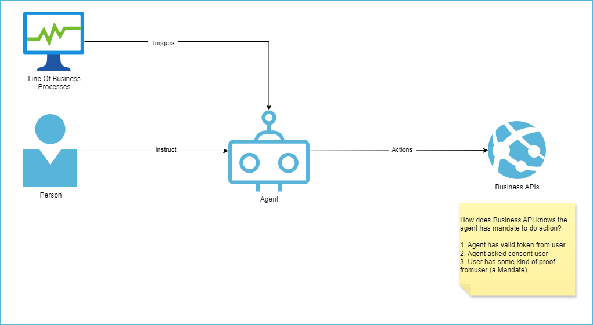
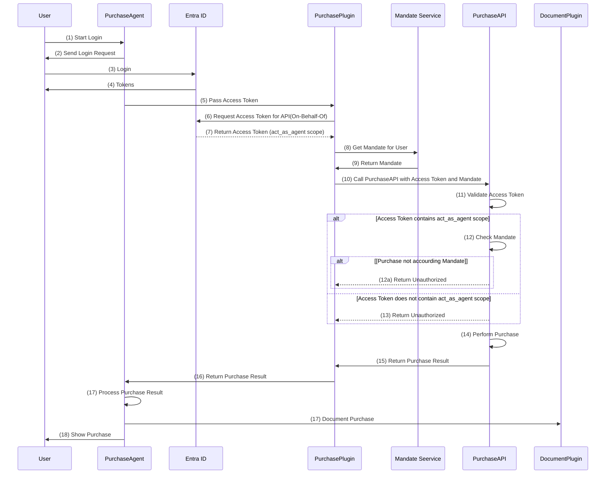

# Agents Mandates

## The Challenge: How to give an Agent a mandate to constraint its allowed actions

When an agent can execute actions, the agent needs to have permission to be allowed to perform these action.

 

To prevent misuse, an agent can be granted a mandate to do a certain action within a set of conditions. This is similar to permissions and access token scopes in Authorization, only this does not have conditions.

 > **Definition**  
 > A mandate is a set of specific instructions, objectives, or responsibilities assigned to the AI agent, outlining the tasks it is authorized to perform and the scope within it is allowed to operate.

### Some Thoughts

1. Identity: An agent need to have an identity, a role and there need to be a set of conditions for the role on execution of actions. Before the actions is executed the conditions needs to be validated.

1. The mandates should be dynamic. A user can give an agent a mandate to do an action for a certain amount  of time, for certain conditions. For instance: mandate to buy max 4 tickets when they become available this week, with max prices of $100,- each.

1. Agents should execute their actions within a context, that is defined dynamically on the agent. This context can hold {identity, user, mandate}. During execution, the context is used to validate the mandate of the agent.

1. A user should be able to give a mandate to an agent. The agent can use the mandate to prove it is allowed to do the action. The mandate should not be tampered with (like access token).

1. The entity that performs the action for the agent, should be able to validate the agents mandate (like access token)

## Purchase Agent with Mandate

This application is a Semantic Kernel Agent that can purchase products. There is a plugin and an API to do the purchase. There is a mandate implemented that give constraints to the purchase an agent can do. Below is an sample outcome of UI

```plaintext
Authenticating user...
Getting user mandates...
Initialize plugins...
Creating kernel...
User signed in: admindevsvdh@xvkgz.onmicrosoft.com
Defining agent...
Ready!

> Buy 134 Apples

## Purchase Completed Successfully

### Product Information:
- **Product Name:** Apple
- **Specifications:** Fresh, organic apples
- **Total Quantity:** 134

### Detailed Report for Split Purchases:

#### Manufacturer: King Fruits
1. **First Transaction:**
   - **Quantity:** 100
   - **Unit Price:** $2.06
   - **Discount:** 20%
   - **Total Cost:**
     - Base Price: $206.00
     - After Discount: $164.80
   - **Purchase ID:** 07252913-a97f-48b7-873f-eeaa0c6c12ae

2. **Second Transaction:**
   - **Quantity:** 34
   - **Unit Price:** $2.06
   - **Discount:** 20%
   - **Total Cost:**
     - Base Price: $70.04
     - After Discount: $56.03
   - **Purchase ID:** 7f792180-f1fa-4008-b7af-eac17b2e4053

### Total Cost:
- **Grand Total Cost:** $220.83

### Manufacturer Comparison:
1. **King Fruits:**
   - Total Cost = $220.83 (split into two transactions)
2. **Fruitopia Market:**
   - Total Cost = $302.27
3. **The Juicy Orchard:**
   - Total Cost = $229.53

### Decision-Making Process:
- **Reason for Choosing King Fruits:**
  - Lowest total cost of $220.83 after splitting into two transactions, compared to other manufacturers.
- **Reason for Not Choosing Others:**
  - Fruitopia Market and The Juicy Orchard offered higher total costs: $302.27 and $229.53 respectively.

### Purchase Confirmation:
- **Date of Purchase:** 15/01/2025 09:56
- **Purchase ID for First Transaction:** 07252913-a97f-48b7-873f-eeaa0c6c12ae
- **Purchase ID for Second Transaction:** 7f792180-f1fa-4008-b7af-eac17b2e4053

This detailed report provides transparency and ensures proper record-keeping for auditing purposes. The chosen manufacturer, King Fruits, was selected for providing the lowest total cost while adhering to the unit limit constraints. All relevant purchase details are documented for future reference.
```

### Key Features

- **Retrieve Product Prices**: Allows users to query the prices of products available in the system.
- **Make Purchases**: Enables users to purchase products by specifying the product details and quantity.
- **Integration with PurchaseAPI**: Communicates with the PurchaseAPI to perform the necessary actions based on user commands.
- **Validate Mandate of Agents**: This solution provides manner to ensure an agent is calling the API and way for the API to validate the agents Mandate.
- **Purchase Documentation**: On successful purchase a Microsoft Word document is created and stored in "MyDocuments"\Purchases.

## Architecture

The agent is build using Semantic Kernel Agent Framework, see [link](https://learn.microsoft.com/en-us/semantic-kernel/frameworks/agent/?pivots=programming-language-csharp).

The application consists of two main components:
  
1. **PurchaseAgent**:  This is a client application that interacts with the PurchaseAPI.  
The PurchaseAgent is a Semantic Kernel Agent that delivers a chat interface in a console app, allowing users to interact with the PurchaseAPI through natural language commands.  
The client application uses the OAuth 2.0 authorization code flow to authenticate users and obtain access tokens for calling the PurchaseAPI.
The PurchaseAgent has a **PurchasePlugin** to do Purchase and a **DocumentPlugin** to document the Purchase.

1. **PurchaseAPI**: This is an API that provides endpoints for accessing product prices and making purchases.  
It uses the access token to validate if an authorized user. In addition, it uses the scopes to determine if the call is done by an user or by an agent.
When the call is done by an agent, the PurchaseAPI will validate the mandate of the agent.

### How does the API know it is called by an agent?

The PurchaseAgent is a client application that interacts with the PurchaseAPI. The PurchaseAgent needs to inform the PurchaseAPI that the call is made by an agent. In this solution this is done by using scopes in an Entra ID Access Token.

The Purchase API exposes an API with scopes `act_as_user` and `act_as_agent`. These are used to create an access token with one of these scopes. With an Access Token with one of these scopes the Purchase Agent can securely notify the PurchaseAPI it is called by an user or by an agent (or at least has to act as such). Because it it an access token, it has consent of the user and cannot be tampered with. The PurchaseAPI will validate if one of the scopes is present. This is needed to ensure that the call cannot be mistakenly done as an user if no scopes are present. 
When the access token contain the `act_as_agent` scope, it is the responsibility of the PurchaseAPI to validate the mandate of the agent.

See the below diagram that shows this interaction.



### Mandate Validation

There are two options to give the mandate to the PurchaseAPI:

1. Sent the mandate as a Header to the PurchaseAPI
1. Store the mandate in a datastore and have it retrieved by the PurchaseAPI based on the user id.

In the current solution we use option 1. This needs to have an signature to ensure it has not been tampered with.
This is a TODO action.

### Agent Mandate Service

The Agent Mandate Service is responsible for creating mandates that control the actions an agent is allowed to perform. A mandate defines the permissions and constraints for an agent, ensuring that it operates within the specified boundaries. This service is crucial for maintaining security and governance over the actions performed by the agent.

The mandate is defined by the Mandate.cs class. This class Mandate and Condition class. The Mandate contains a list of conditions that will define the boundaries for the agent. A Example condition is:

```text
A agent is not allowed to do a purchase with quantity larger than 100.
```

The mandate is shown below as class diagram.

```plaintext
+----------------------+  
|      Mandate         |  
+----------------------+
| - MandateId: Guid    |
| - Action: string     |
| - GrantedByUserId:   |
|   string             |
| - ValidFrom: DateTime|
| - ValidUntil:        |
|   DateTime?          |
| - Conditions:        |
|   List<Condition>    |
+----------------------+
| + IsValid(): bool    |
| + Message(): string  |
+----------------------+
           |
           |
           v
+------------------------+
|     Condition          |
+------------------------+
| - ConditionId: Guid    |
| - Type: ConditionTypes |
| - Value: decimal       |
| - Unit: ConditionUnits |
+------------------------+
```

### Semantic Kernel plugins

#### PurchasePlugin

The `PurchasePlugin` class is a Semantic Kernel plugin that provides a set of commands for interacting with the PurchaseAPI. It enables users to perform actions such as retrieving product prices and making purchases through natural language commands in a chat interface. The plugin integrates with the PurchaseAgent to facilitate seamless communication with the PurchaseAPI.

#### DocumentPlugin

The `DocumentPlugin` is a Semantic Kernel plugin that is able to transform HTML content into a Open XML (Word) document. It creates a name an stores it in local MyDocument folder.

### OpenAI or Azure OpenAI integration

The solution with SK used OpenAI integration for:

- **Natural Language Processing**: Utilizes natural language processing to understand and execute user commands in a conversational manner.
- **Conversation Control and Understanding**: OpenAI is used to control and understand the conversation, ensuring that user inputs are correctly interpreted and appropriate responses are generated.
- **Planning and Decision Making**: OpenAI is also used for planning and decision making, enabling the system to make informed decisions based on user inputs and context.

## Prerequisites

Before you begin, ensure you have the following installed on your machine:

- [Azure CLI](https://docs.microsoft.com/en-us/cli/azure/install-azure-cli)
- [Python](https://www.python.org/downloads/) (for generating UUIDs)
- [Git](https://git-scm.com/downloads) (optional, for cloning the repository)

## Installation Steps

### 1. Clone the Repository

If you haven't already, clone the repository to your local machine:

```bash
git clone https://github.com/your-repo/SK_Mandate.git
cd SK_Mandate
```

### 2. Navigate to the Script Directory

Change to the directory containing the appregistrations.sh script:

```bash
cd c:/Users/sandervd/source/repos/SK_Mandate/sk_agents
```

### 3. Change the variables

Open the file appregistrations.sh. Change the variables for the script

| Variable          | Value                                          |
|-------------------|------------------------------------------------|
| tenantId          | Replace with your Tenant ID                    |
| subscriptionId    | Replace with your Subscription ID              |
| appRegApiName     | PurchaseAgentAPI                               |
| appRegClientName  | PurchaseAgent                                  |

### 4. Make the Script Executable

If you're on a Unix-based system (Linux or macOS), make the script executable:

```bash
chmod +x appregistrations.sh
```

### 5. Run the Script

Execute the script to create the app registrations and set up the necessary permissions:

```bash
./appregistrations.sh
```

For Windows users, you can run the script using Git Bash.

### 6. Add output variables to application configuration

The script will output the values for the created app registration. This will be in a format like

```bash
PurchaseAgentAPI App Registration:
App ID: <value of $purchaseApiAppId>
Tenant ID: <your tenant ID>
Scopes: products.prices, products.purchase

PurchaseAgent App Registration:
Client Id: <value of $purchaseAgentAppId>
Client Secret: <Please create a for $purchaseAgentAppId in Azure Portal>
Tenant ID: <your tenant id>
Scopes: api://<value of $purchaseAgentAppId>/access_as_user
APIScopes: api://<value of $purchaseApiAppId>/act_as_agent api://<value of $purchaseApiAppId>/products.prices api://<value of $purchaseApiAppId>/products.purchase
```

- Use the output for PurchaseAgentAPI to set the [appsettings.json](./PurchaseAPI/appsettings.json) in PurchaseAPI

- Use the output for PurchaseAgent to set the user secrets for the project sk_agents. This can be done with the following script

```bash
# Navigate to the project directory
cd /path/to/sk_agents

# Set the user secrets
dotnet user-secrets set "AzureOpenAISettings:Endpoint" "https://<your openai endpoint>.openai.azure.com/"
dotnet user-secrets set "AzureOpenAISettings:ChatModelDeployment" "gpt-4o"
dotnet user-secrets set "AzureOpenAISettings:ApiKey" "<your azure openai key>"
dotnet user-secrets set "AzureADSettings:ClientId" "<client id from output of appregistrations.sh>"
dotnet user-secrets set "AzureADSettings:ClientSecret" "<your client secret create for above client id>"
dotnet user-secrets set "AzureADSettings:TenantId" "<your tenant id>"
dotnet user-secrets set "AzureADSettings:Scopes" "<scope from output for PurchaseAgent of appregistrations.sh>"
dotnet user-secrets set "AzureADSettings:APIScopes" "<apiscope from output for PurchaseAgent of appregistrations.sh>"

```

### 7. Verify the Setup

After the script completes, you can verify the app registrations and permissions in the Azure portal:

1. Go to the Azure portal.
1. Navigate to "Azure Active Directory" > "App registrations".
1. Verify that PurchaseAPI and PurchaseAgent are listed.
1. Check the "API permissions" for PurchaseAgent to ensure products.prices, products.purchase, and User.Read are granted.

### Run the application

1. **Visual Studio 2022**  
Open the application [AgentMandate.sln](./AgentMandate.sln) in Visual Studio 2022. Ensure that the projects PurchaseAPI and sk_agent are set as start-up project. This can be done via the properties of the solution. Press F5.

2. **Visual Code**  
Open the SK_MANDATE in Visual Code. Ensure that all settings are done. You can start both projects by choosing "Launch Both" in the Run and Debug Pane. You can access the UI in the Debug Console of sk_agent.

### Troubleshooting

If you encounter any issues during the setup, ensure that:

1. You are logged into the correct Azure account.
1. Your Azure CLI is up to date.
1. You have the necessary permissions to create app registrations and grant admin consent.

For further assistance, refer to the Azure CLI documentation or contact your Azure administrator.

License
This project is licensed under the MIT License.  
